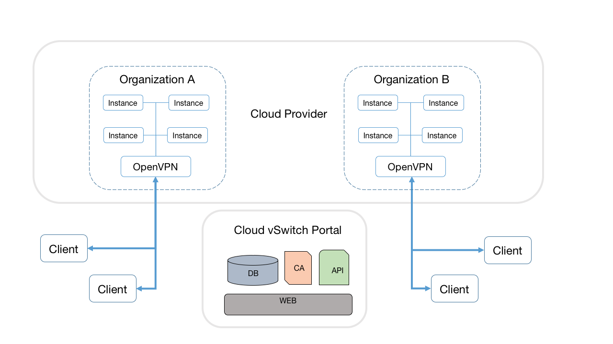
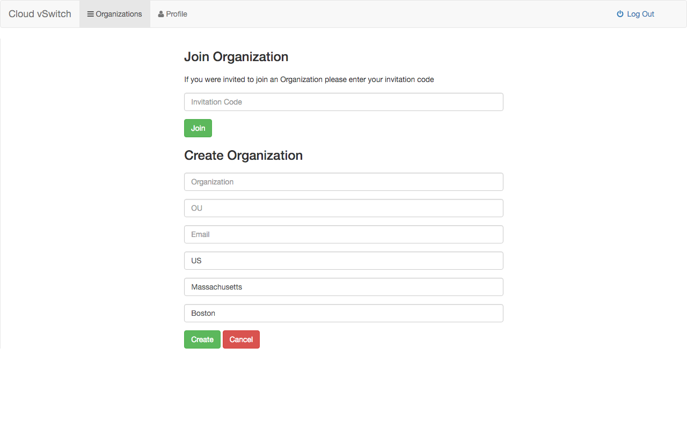
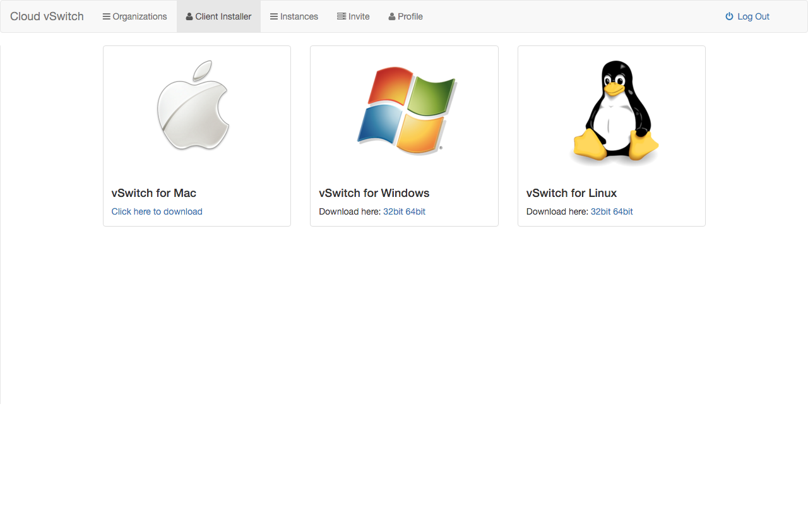

# Cloud vSwitch

# Introduction

Cloud vSwitch seeks to provide a secure and streamlined IT independent VPN as a service in the cloud, targeted to organizations with no IT department or users without VPN experience.

# Features

## Architecture

<p align="center"></p>

## Key Designs

- **vSwitch Portal**   
Cloud vSwitch portal is a key point in architecture. It allows users to easily create an organization and setup a VPN environment with a few clicks. It is a fully responsive web App built with AngularJS and Bootstrap.

- **vSwitch API**  
vSwitch API is a **RESTful API** to support all Cloud vSwitch operations. We took advantage of [Sails.js](https://github.com/balderdashy/sails), a framework that makes it easy to build custom Node.js apps.

- **OpenVPN**   
To provide a stable VPN service, we choose to adopt [OpenVPN]() as our choice of VPN service provider. Why build a VPN tool from ground when we have open source solutions?

- **Instances and vSwitch instance**   
Difference between these two terms are "vSwitch instance" is actually the instance that provide the service in the cloud. "Instance" is just simple virtual machine and later it can support any local senstive service such as NFS.

**Users and Organizations**   
<p align="center"></p>


- **Cross-platform applications**   
Usage of the VPN as a Service is cross-platform, which means you can access from any main distribution of OS, Mac OS, Linux, and Windows.

<p align="center"></p>


# Installation


**Prerequisies**

Before you start the default install process, make sure you have access to ```npm```, ```git``` and ```bower```.

The deployment of Cloud vSwitch requires a cloud environment and a portal to place your own vSwitch portal. After the deployment, you can easily and directly get access to the virtual LAN in the cloud! 

**Preparing the system (Ubuntu)**
```sh 
$ sudo apt-get update
$ sudo apt-get install build-essential git
$ curl -sL https://deb.nodesource.com/setup_5.x | sudo -E bash -
$ sudo apt-get install -y nodejs
```

**Creating Openssl CA**
```sh 
$ git clone https://github.com/BU-NU-CLOUD-SP16/Cloud-vSwitch.git
$ cd CA
$ sh ca.sh
```
This will generate cacert.pem, cakey.pem and dh files required by Cloud vSwitch API

**Set up MongoDB database**
```sh 
$ sudo apt-get install mongodb-server
```
Also, Cloud vSwitch can use services like mongolab. It only requires to set the proper env variable as shown below.


**Setup the vSwitch API** 
```sh 
$ git clone https://github.com/BU-NU-CLOUD-SP16/Cloud-vSwitch.git
$ cd vSwitch-API
$ npm install

# setup environment variables
##  CA 
$ export CACERT='cat cacert.pem'
$ export CAKEY='cat cakey.pem'
$ export DH='cat dh.pem'

## Mongo
$ export MONGO_URI='mongodb://user@host:port/database'

## MOC
$ export MOC_USER='bwayne@mycloud.com'
$ export MOC_PASSWORD='xxxxxxx'
$ export MOC_TENANT='xxxxxxx'
$ export MOC_NETWORK='xxxxxxx'

## Email
$ export SENDGRID_API='xxxxxxx'
$ export SENGRID_FROM='admin@mycloud.com'
## App
$ export TOKEN_SECRET='xxxxxxxx'
$ export UI_ENDPOINT='https://...'
```

To deploy the API, run:
```sh
$ npm start
```

 **Setup and configure the vSwitch Portal, aka UI**
```sh 
$ git clone https://github.com/BU-NU-CLOUD-SP16/Cloud-vSwitch.git
$ cd vSwitch-UI
$ npm install
```

**Update API endpoint**
```sh 
$ vim app/scripts/app.js
  var endpoint = 'https://xxxxxx';
```
 
To run:
```sh
$ sudo node index.js
```
 
 **Generate Client Apps**
```sh
$ npm install electron-packger
$ git clone https://github.com/BU-NU-CLOUD-SP16/Cloud-vSwitch.git
$ cd vSwitch-Client
$ sh build
```


# Usage

After successfully setting up the vSwitch API launching the vSwitch Portal, now you are able to visit the web portal and start to manage your Cloud!   

1. Register and create your organization.    
2. Choose the platform you are working on and follow the client side application process.   
3. Now you should be able to both access and modify. The dashboard should be working, too.   

# Contributors

**Cloud vSwitch Team**:

Javier Arguello jas91[at]bu.edu   
Shuwen Sun shwsun[at]bu.edu   
Xuanyi Chen troychen[at]bu.edu   
Varshith Hakkithimmanahalli Anilkumar varshith[at]bu.edu   


**Mentors**:

Karl Redgate

# License

The license is GPLv3.

Copyright (C) 2016-2017 by Cloud vSwitch(See Contributors). 


	Cloud vSwitch is free software: you can redistribute it and/or modify
	it under the terms of the GNU General Public License as published by
	the Free Software Foundation, either version 3 of the License, or
	(at your option) any later version.

	Cloud vSwitch is distributed in the hope that it will be useful,
	but WITHOUT ANY WARRANTY; without even the implied warranty of
	MERCHANTABILITY or FITNESS FOR A PARTICULAR PURPOSE.  See the
	GNU General Public License for more details.
	
	You should have received a copy of the GNU General Public License
	along with Cloud vSwitch.  If not, see <http://www.gnu.org/licenses/>.

