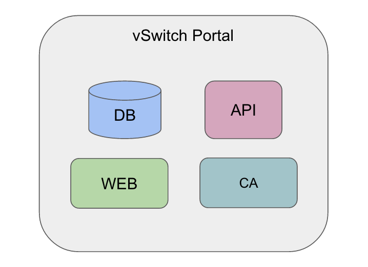
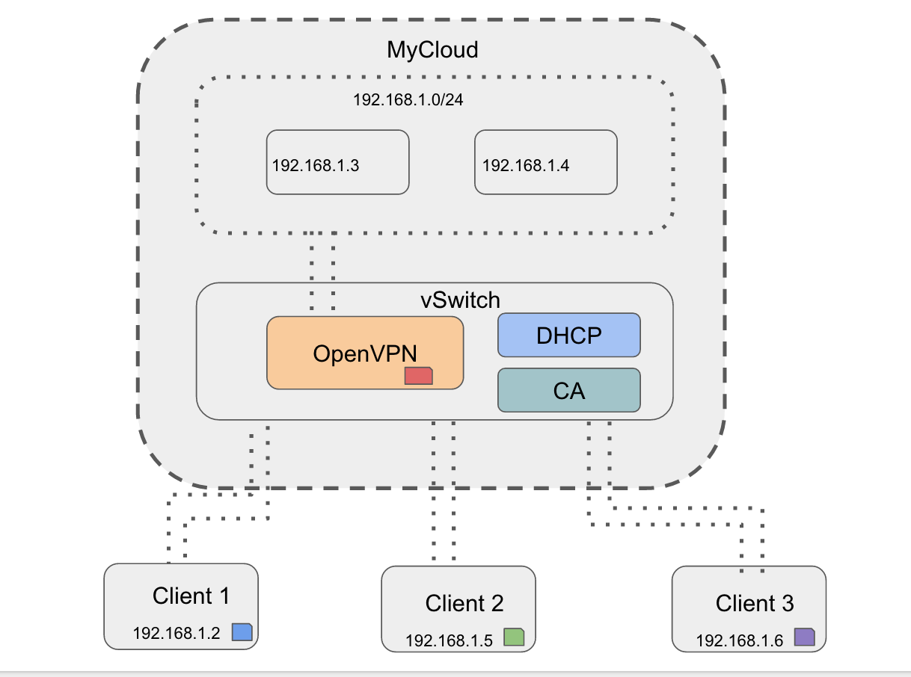
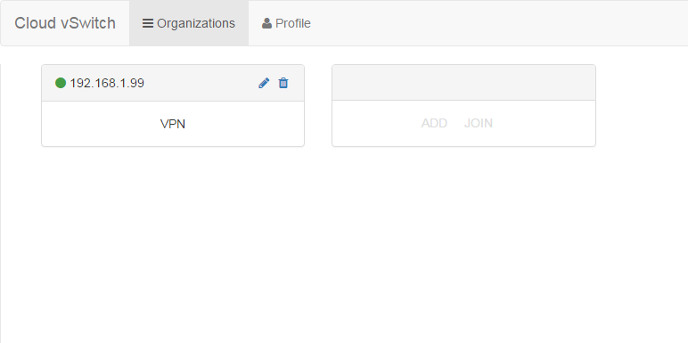
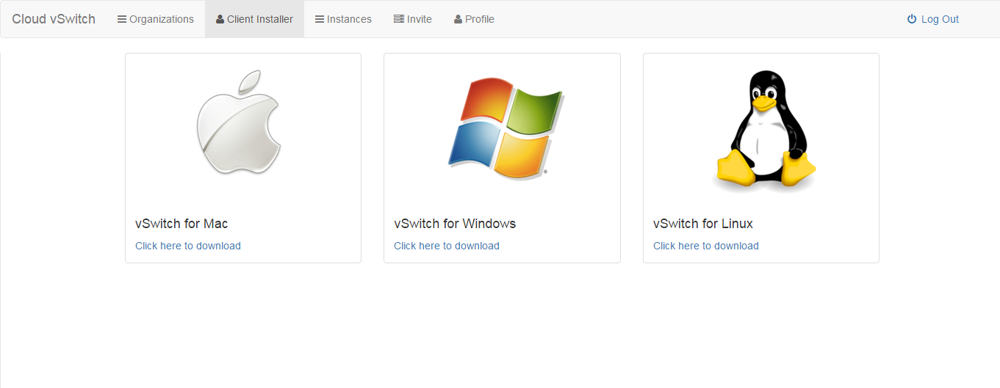
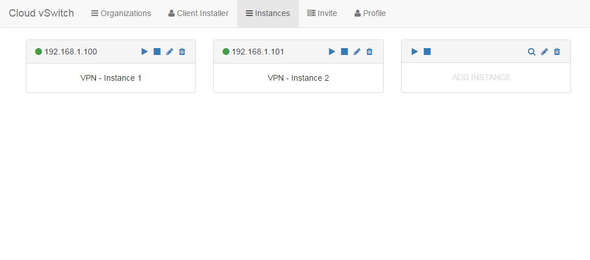
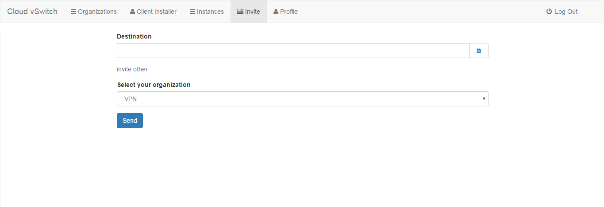

# Cloud vSwitch

<!---->
<!--img src="doc/img/cv-arch.png" alt="arch" width="650"-->


TODO: logo and pic

# Introduction

Cloud vSwitch seeks to provide a secure and streamlined IT independent VPN as a service in the cloud.

# Features

## Architecture

- **vSwitch Portal**   
Cloud vSwitch portal is a key point in architecture. It allows users to easily create an organization and setup a VPN environment with a few clicks.




- **Cloud environment and Clients**   




## Key Designs

- **vSwitch API**  
vSwitch API is a **RESTful API** to support all Cloud vSwitch operations. We took advantage of [Sails.js](https://github.com/balderdashy/sails), a framework that makes it easy to build custom Node.js apps.

- **OpenVPN**   
To provide a stable VPN service, we choose to adopt [OpenVPN]() as our choice of VPN service provider. Why build a VPN tool from ground when we have open source solutions?

- **Instances and vSwitch instance**   
Difference between these two terms are "vSwitch instance" is actually the instance that provide the service in the cloud. In this release, "instance" is just simple virtual machine and later it can support any local senstive service such as NFS.

**Users and Organizations**   


- **Cross-platform applications**   
Usage of the VPN as a Service is cross-platform, which means you can access from any main distribution of OS, Mac OS, Linux, and Windows.


# Installation

**Prerequisies**

Before you start the default install process, make sure you have access to ```npm```, ```git``` and ```bower```.

The deployment of Cloud vSwitch requires a cloud environment and a portal to place your own vSwitch portal. After the deployment, you can earily and directly get access to the virtual LAN in the cloud! 


## Default installation

By default, we use the MOC to hold the cloud side. However, Amazon EC2, Microsoft Azure, and similiar service by other providers should also be able to setup this VPN as a Service.

1. **Setup the vSwitch API** 
```sh 
$ git clone https://github.com/BU-NU-CLOUD-SP16/Cloud-vSwitch.git
$ cd vSwitch-API
$ npm install
$ bower install

# setup environment variables
##  CA
$ export CACERT='...'
$ export CAKEY='...'
$ export DH='...'
## Mongo
$ export MONGO_URI='...'
## MOC
$ export MOC_USER='...'
$ export MOC_PASSWORD='...'
## Email
$ export SENDGRID_API='...'
$ export SENGRID_FROM='...'
## App
$ export TOKEN_SECRET='...'
$ export UI_ENDPOINT='...'
```

TODO: a easier way to config, i.e. user can create a config file to do it.   

To generate the API, run:
```sh
sails lift
```

2. **Setup and configure the vSwitch Portal, aka UI**
```sh 
$ git clone https://github.com/BU-NU-CLOUD-SP16/Cloud-vSwitch.git
$ cd vSwitch-UI
$ npm install
$ bower install
```
 
To run:
```sh
$ grunt serve or node index.js
```


TODO: Describe the installation process


# Usage

First of all, you should visit the Cloud vSwitch website https://cloud-vswitch.herokuapp.com/#/login
and create an account if you do not have one in advance. Once the registration is done, you can create your organization following the instruction page that comes up. You should input the name, owner of the organization and the default email address. 


Once the organization is created successfully, you will be redirected to a list all the organizations that you are in as shown below:



Now you are ready to download the client installer by clicking the “Client Installer” on the dashboard for your system:



When the download is finished, click the “vSwitch.exe” in the folder and you will be asked to input your credential. After that, you will be directed to your organization.

When you click on the name of the organization in the list, you will be guided to the list of instances of the very organization. If there is no instance, you will be prompted to provide name of the instance to set up the first one. Once succeed, the instance list will look like this: 



You can see the status of your instance according to the “light” indicator on the instance tab. When the “light” is green, the instance is already deployed on the MOC. You can stop, resume, modify, delete your instance at any time.

If you want to invite your colleague into your organization, click on the invite on the dashboard:



You should enter the email address of your colleague and he/she will receive an email along with the invitation code to join the organization.


# Contributors

**Cloud vSwitch Team**:

Javier Arguello jas91@bu.edu   
Shuwen Sun shwsun@bu.edu   
Xuanyi Chen troychen@bu.edu   
Varshith Hakkithimmanahalli Anilkumar varshith@bu.edu   


**Mentors**:

Karl Redgate

# License

The license is GPLv3.

TODO: Write license
